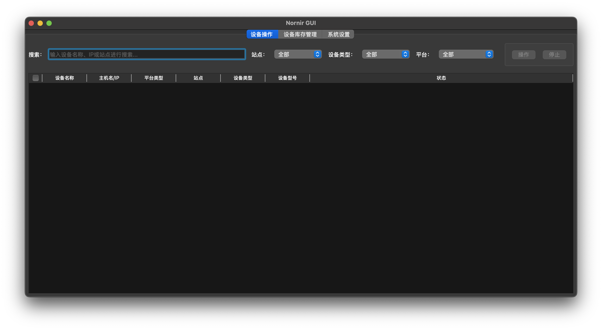

# Nornir GUI

一个基于 Nornir 和 PySide6 开发的网络自动化工具，提供图形界面实现网络设备的批量配置、命令下发、状态查询等功能。
目前就支持华为和h3c的设备。

## 功能特性

- 📱 图形界面
- 🚀 批量配置和命令下发
- 💾 配置备份和对比
- 🔍 设备状态查询
  - 交换机的接口信息查询
  - 交换机的MAC/IP 地址查询
  - 防火墙的DNAT 配置查询
- 💡 命令模式
  - 支持视图命令模式
  - 支持配置命令模式
  - 支持交互命令模式

## 界面预览



## 系统要求

- Python 3.12 或更高版本
- 支持的操作系统：
  - Windows 11 主要使用的版本
  - macOS 测试了，感觉没windows好用

## 快速开始

### 从源码构建

1. 克隆仓库：

```bash
git clone https://github.com/mam15mon/nornir-gui.git
cd nornir-gui
```

2. 创建并激活虚拟环境：可选的

```bash
# Windows
python -m venv venv
venv\Scripts\activate

# macOS/Linux
python3 -m venv venv
source venv/bin/activate
```

3. 安装依赖：

```bash
pip install -r requirements.txt
```

4. 运行程序：

```bash
python main.py
```

### 构建可执行文件

1. 安装 PyInstaller：

```bash
pip install pyinstaller
```

2. 执行构建：

```bash
python build.py
```

构建完成后，可执行文件将位于 `release` 目录中。Windows 系统生成 `.exe` 文件，macOS 系统生成可执行文件。

> 注意：目前项目处于开发阶段。建议从源码构建使用。

## 配置说明

### 设备库存配置

1. 在库存界面点击"添加设备"
2. 填写设备信息：
   - 设备名称
   - IP地址
   - 登录凭据
   - 设备类型
3. 点击"保存"完成添加

### 命令模式

- **视图命令模式**：用于执行 display 等查看命令
- **配置命令模式**：用于执行配置命令，自动进入配置视图
- **交互命令模式**：用于执行需要交互的命令，支持自定义期望提示符，也可以用timing模式，就不需要期望提示符了

## 贡献指南

欢迎任何形式的贡献：

- 🐛 报告 Bug
- 💡 提供建议
- 📝 改进文档
- 🔧 提交代码

## 许可证

本项目采用 MIT 许可证 - 查看 [LICENSE](LICENSE) 文件了解详情。
