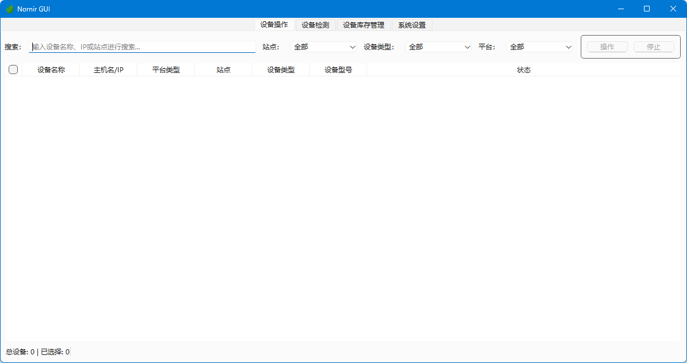

# 网络设备巡检工具

一个基于 Nornir 和 PySide6 开发的网络自动化工具，提供图形界面实现网络设备的批量配置、命令下发、状态查询和设备巡检等功能。
目前支持华为和H3C设备的全面巡检。

## 功能特性

- 📱 现代化图形界面
- 🚀 批量配置和命令下发
- 💾 配置备份和对比
- 🔍 设备状态查询
  - 交换机的接口信息查询
  - 交换机的MAC/IP 地址查询
  - 防火墙的DNAT 配置查询
- 🔎 设备巡检功能
  - CPU使用率检测
  - 内存使用率检测
  - 电源状态检测
  - 风扇状态检测
  - NTP同步状态检测
  - 接口错误检测
  - 设备告警检测
- 💡 命令模式
  - 支持视图命令模式
  - 支持配置命令模式
  - 支持交互命令模式

## 界面预览

### 设备管理界面


### 设备巡检界面
设备巡检界面提供了直观的树形结构显示检测结果，支持从摘要表格跳转到详细信息，方便查看各项检测指标。

#### 摘要视图
摘要视图显示所有设备的检测结果概览，包括设备类型、状态和详情。双击或右键点击可跳转到详细信息。

#### 详细信息视图
详细信息视图使用树形结构展示每个设备的详细检测结果，包括CPU、内存、电源、风扇、NTP、接口错误和告警等指标。

## 系统要求

- Python 3.12 或更高版本
- 支持的操作系统：
  - Windows 11 主要使用的版本
  - macOS 测试了能用

## 快速开始

### 从源码构建

1. 克隆仓库：

```bash
git clone https://github.com/mam15mon/nornir-gui.git
cd nornir-gui
```

2. 创建并激活虚拟环境：可选的

```bash
# Windows
python -m venv venv
venv\Scripts\activate

# macOS/Linux
python3 -m venv venv
source venv/bin/activate
```

3. 安装依赖：

```bash
pip install -r requirements.txt
```

4. 运行程序：

```bash
python main.py
```

### 构建可执行文件

1. 安装 PyInstaller：

```bash
pip install pyinstaller
```

2. 执行构建：

```bash
python build.py
```

构建完成后，可执行文件将位于 `release` 目录中。Windows 系统生成 `.exe` 文件，macOS 系统生成可执行文件。

> 注意：目前项目处于开发阶段。建议从源码构建使用。

## 配置说明

### 设备库存配置

1. 在库存界面点击"添加设备"
2. 填写设备信息：
   - 设备名称
   - IP地址
   - 登录凭据
   - 设备类型
3. 点击"保存"完成添加

### 命令模式

- **视图命令模式**：用于执行 display 等查看命令
- **配置命令模式**：用于执行配置命令，自动进入配置视图
- **交互命令模式**：用于执行需要交互的命令，支持自定义期望提示符，也可以用timing模式，就不需要期望提示符了

## 设备巡检功能

设备巡检功能可以自动检测网络设备的运行状态，帮助网络管理员快速发现和解决潜在问题。

### 使用方法

1. 选择包含设备配置文件的目录
2. 点击"开始检测"按钮
3. 查看检测结果：
   - 摘要选项卡：显示所有设备的检测结果概览
   - 详细信息选项卡：显示每个设备的详细检测结果
4. 双击摘要表格中的设备行或右键点击并选择"查看详细信息"，可跳转到对应设备的详细信息

### 检测项说明

#### CPU检测

检测设备CPU使用率，当使用率超过80%时判定为异常。

- **H3C设备**：检测5秒、1分钟和5分钟的CPU使用率
- **华为设备**：检测当前使用率和最大使用率

#### 内存检测

检测设备内存使用率，当使用率超过80%时判定为异常。

- **H3C设备**：支持多种内存输出格式，包括老格式和新格式
- **华为设备**：支持多种格式，但正则表达式不同

#### 电源检测

检测设备电源状态，当状态不为"Normal"时判定为异常。

- **H3C设备**：使用"display power"命令
- **华为设备**：使用"display device"命令

#### 风扇检测

检测设备风扇状态，当状态不为"Normal"时判定为异常。

- **H3C设备**：使用"display fan"命令
- **华为设备**：使用"display device"命令

#### NTP检测

检测设备NTP同步状态，当状态不为"synchronized"时判定为异常。

- **H3C设备**：检查"Clock status: synchronized"
- **华为设备**：检查"clock status: synchronized"

#### 接口错误检测

检测设备接口是否有错包，当有错包时判定为异常。

- **H3C设备**：使用"display counters outbound | inbound interface"命令
- **华为设备**：使用"display interface brief"命令

#### 告警检测

检测设备是否有活动告警，当有活动告警时判定为异常。

- **H3C设备**：使用"display alarm"命令
- **华为设备**：使用"display alarm active"命令

### 结果解读

- **正常**：绿色，表示该项检测正常
- **警告**：黄色，表示需要注意但不是严重问题
- **异常**：橙色，表示存在异常情况需要处理
- **错误**：红色，表示存在严重问题或命令执行错误

## 贡献指南

欢迎任何形式的贡献：

- 🐛 报告 Bug
- 💡 提供建议
- 📝 改进文档
- 🔧 提交代码

## 许可证

本项目采用 MIT 许可证 - 查看 [LICENSE](LICENSE) 文件了解详情。
